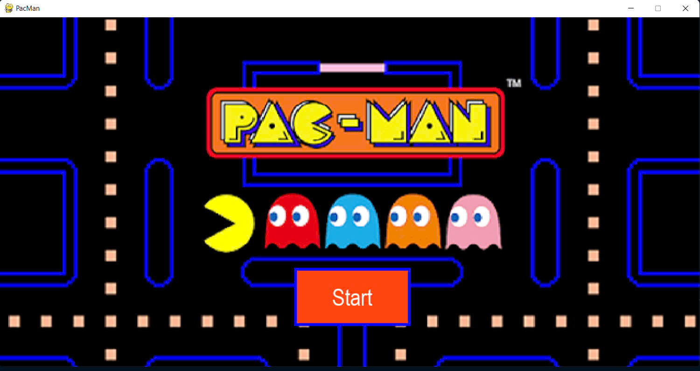
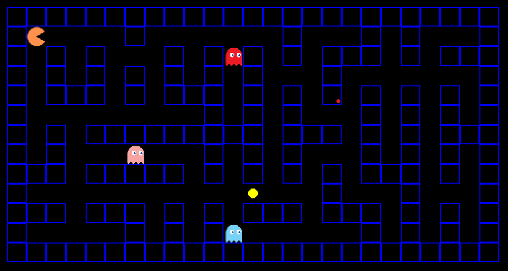
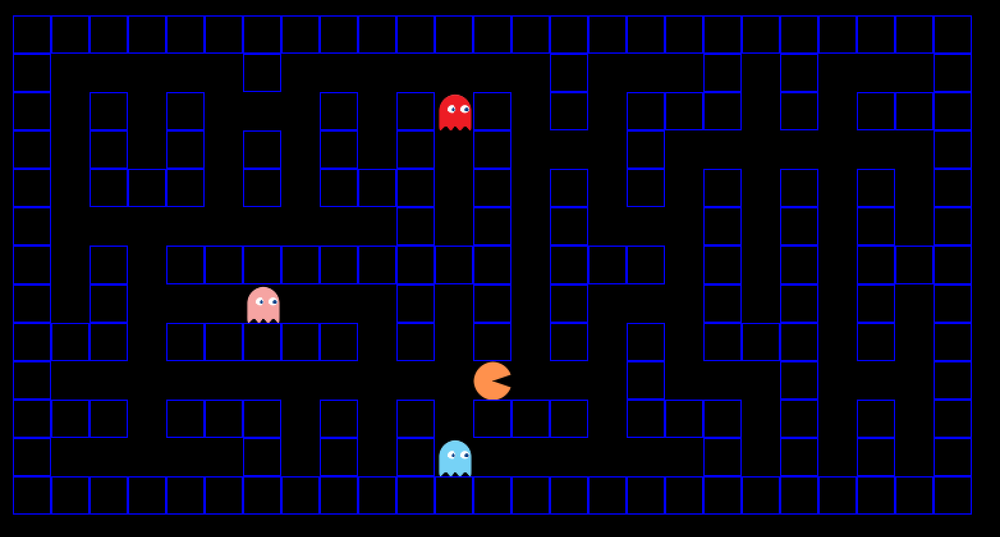

# Pacman-project
# 🟡 Pacman-AI - Tìm Đường Cho Pacman Bằng AI

## 📌 Sơ lược Project

Đây là một đồ án trí tuệ nhân tạo mô phỏng trò chơi Pacman. Mục tiêu là xây dựng các thuật toán tìm kiếm để Pacman thu thập thức ăn, tránh quái vật và tìm đường tối ưu trên bản đồ. Dự án gồm 4 cấp độ (level), mỗi level tăng độ phức tạp:

- **Level 1:** 1 thức ăn, không có quái vật.
- **Level 2:** 1 thức ăn, có quái vật đứng yên.
- **Level 3:** Nhiều thức ăn, quái vật di chuyển quanh vị trí ban đầu, tầm nhìn Pacman giới hạn.
- **Level 4:** Quái vật đuổi theo Pacman, Pacman cố gắng ăn nhiều nhất có thể trước khi bị bắt.

## 🔍 Thuật toán sử dụng

- **Level 1:** Breadth-First Search (BFS)
- **Level 2:** BFS có kiểm tra tránh quái vật
- **Level 3:** Heuristic Local Search
- **Level 4:** GREEDY, MINIMAX, BFS, UCS, A*, IDA* (cho Pacman) và A* (cho quái vật)

## 💰 Hàm tính chi phí

- **BFS:** Mỗi bước đi được tính chi phí bằng 1 (uniform cost)
- **A***:  
  `f(n) = g(n) + h(n)`  
  Trong đó:  
  - `g(n)`: chi phí từ trạng thái đầu đến trạng thái hiện tại  
  - `h(n)`: heuristic – thường là khoảng cách Manhattan đến thức ăn hoặc để tránh quái vật
- **Minimax:** Dựa trên số lượng thức ăn còn lại và khoảng cách tới quái vật

## ⚙️ Các hàm chính hoạt động

- `run_BFS(start, goal)`: Tìm đường từ điểm đầu đến đích bằng BFS.
- `A_star(start, goal)`: Tìm đường tối ưu cho quái vật bằng thuật toán A*.
- `Minimax(state, depth)`: Tính nước đi tốt nhất cho Pacman với chiến lược Minimax.
- `update_game_state()`: Cập nhật vị trí Pacman, quái vật, kiểm tra thắng/thua.
- `draw_game()`: Vẽ lại bản đồ game sau mỗi lượt chơi bằng thư viện Pygame.

## 🚩 Trạng thái đầu và đích

- **Trạng thái đầu:**
  - Vị trí Pacman (`P`)
  - Vị trí quái vật (`M`)
  - Vị trí các thức ăn (`F`)
  - Bản đồ tường (`#`)

- **Trạng thái đích:**
  - Pacman ăn hết thức ăn **hoặc**
  - Bị quái vật bắt (trò chơi kết thúc)

---

## 🧠 Giải thích thuật toán và hàm chi tiết

### 🔹 1. Thuật toán BFS (`run_BFS(start, goal)`)

- **BFS** duyệt theo chiều rộng, dùng hàng đợi để lưu các vị trí chờ xử lý.
- Khi tìm thấy đích (thức ăn), truy vết ngược lại đường đi.

### 🔹 2. A* (`A_star(start, goal)`)

- A* kết hợp giữa chi phí đi thực tế (`g(n)`) và ước lượng còn lại (`h(n)`) để định hướng tìm kiếm.
- Sắp xếp độ ưu tiên dựa trên `f(n) = g(n) + h(n)`.

### 🔹 3. Minimax (`Minimax(state, depth)`)

- Dùng cho trò chơi đối kháng, Pacman (Max) cố gắng tối đa hóa điểm, quái vật (Min) cố gắng bắt hoặc làm giảm điểm.
- Xây dựng cây trò chơi, duyệt từ dưới lên để tìm nước đi tối ưu.

### 🔹 4. GREEDY, UCS, IDA*

- **Greedy:** Chỉ dựa trên heuristic `h(n)`, nhanh nhưng không đảm bảo tối ưu.
- **UCS:** Dựa trên chi phí thực `g(n)` (giống BFS nhưng tính chi phí).
- **IDA***: Duyệt sâu rộng rãi, kết hợp DFS và A* với giới hạn chi phí tăng dần.

### ⚖️ Các hàm hỗ trợ khác

- `get_neighbors(pos)`: Trả về danh sách vị trí có thể đi từ `pos`
- `evaluate(state)`: Đánh giá trạng thái dựa trên thức ăn và quái vật (cho Minimax)
